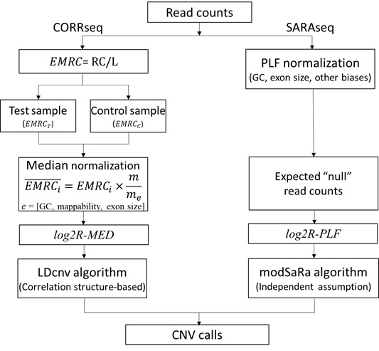

# CORRseq and SARAseq
Copy number variation detection by whole-exome-sequencing (WES) data.
## Author
Xizhi Luo, Fei Qin, Guoshuai Cai, Feifei Xiao
## Description
We have previously shown evidence of the genomic correlation structure in SNP array data and developed a novel chromosomal breakpoint detection algorithm, LDcnv, which showed significantly improved detection power through integrating the correlation structure in a systematic modeling manner. However, it remains unexplored whether the genomic correlation exists in WES data and how such correlation structure integration can improve CNV detection accuracy. 
Here, we proposed a correlation-based method, CORRseq, as a novel release of the LDcnv algorithm in profiling WES data. We also developed an alternative independent-based method in parallel, so as referred to SARAseq, which was built upon on our existing method modSaRa.
## General workflow

